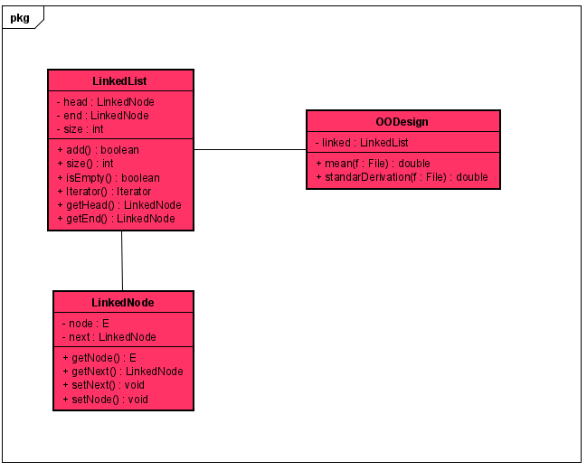
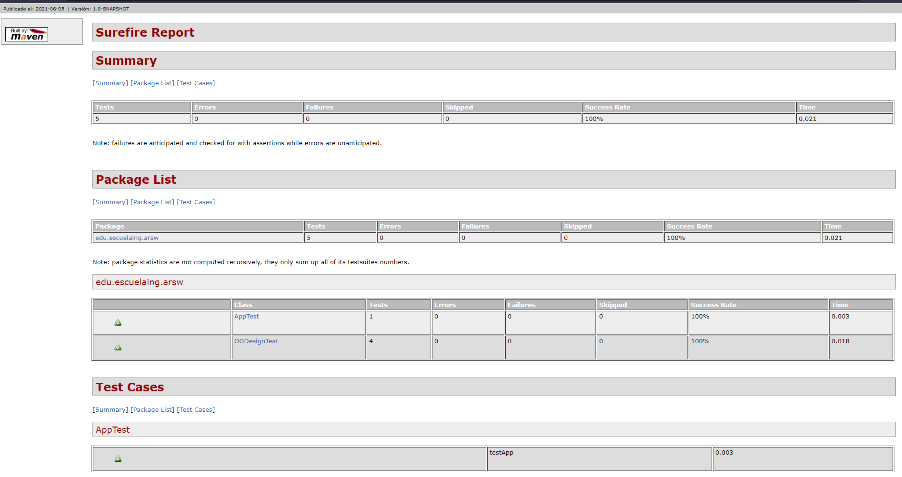
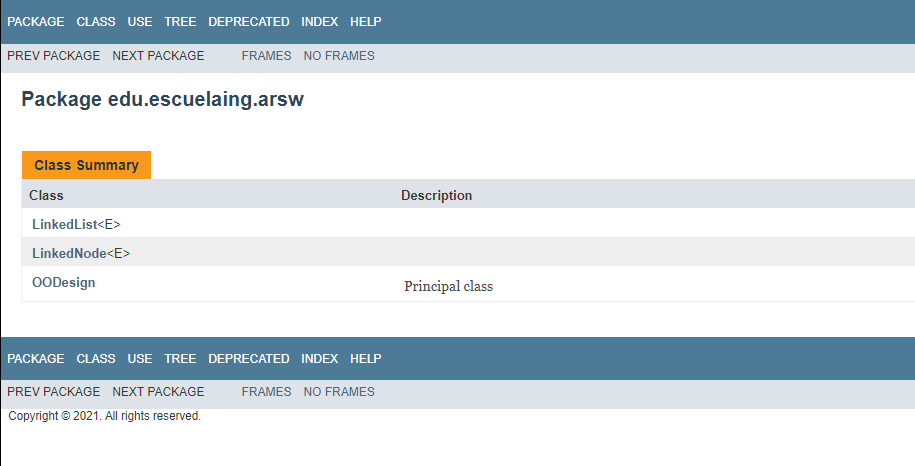
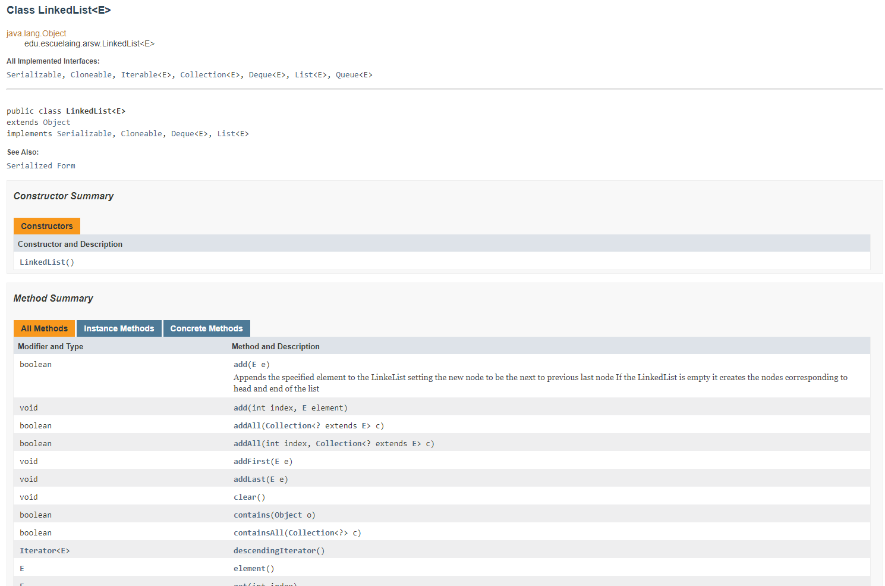
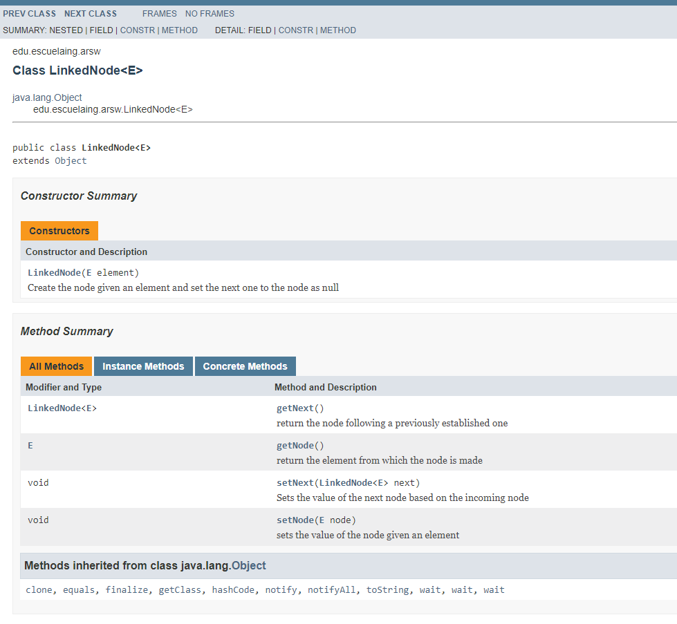
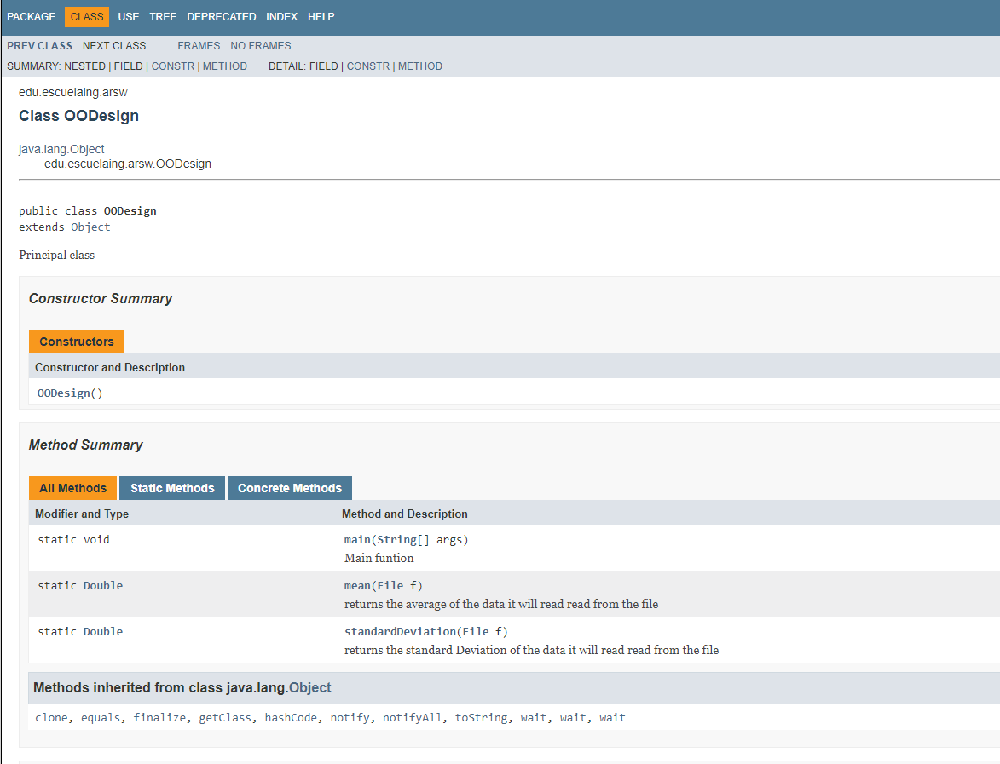

# ARSW
# Autor : Lorenzo Marquez Pinto
# fecha : 05/06/2021
>## LOC/h
>> 464 lineas de codigo en 6<c> horas > 77.3 loc/h
# OODesign Tarea No.2
En esta libreria se desarrollo una lista enlazada compatible con Java Collection(API) que es usada posteriormente para calcular la medio y la desviacion estandar de los datos encontrados en archivos dados, con el fin de resolver la actividad para la materia de ARSW de la Escuela Colombiana de Ingenieria
>> # Media (referida en los archivos como mean)
>> La media es el promedio de un conjunto de datos. El promedio es la medida de ubicación más común para un conjunto de números. El promedio ubica el centro de los datos.

>> # Desviacion Estandar
>> La desviación estándar es una medida de la extensión o dispersión de un conjunto de datos. Cuanto más dispersos estén los valores, mayor será la desviación estándar.
# Pre-Requisitos
Tener java y conocimiento del uso de consola 

#  Ejemplo Modo de uso estando en consola:
~~~ 
  $ java -cp "./target/classes" edu.escuelaing.arsw.OODesign D:\User\Desktop\2021-i\Tareas\Tarea2\OODesign\Resources\Prueba.txt
~~~
# Diagrama de clase 



# TEST
This project includes tests that are located in
```
edu.escuelaing.arsw.OODesignTest
```

# JAVA DOC




# Licencia
Este proyecto esta bajo Licencia de uso libre https://raw.githubusercontent.com/DrLolo03/OODesign/master/LICENSE.
